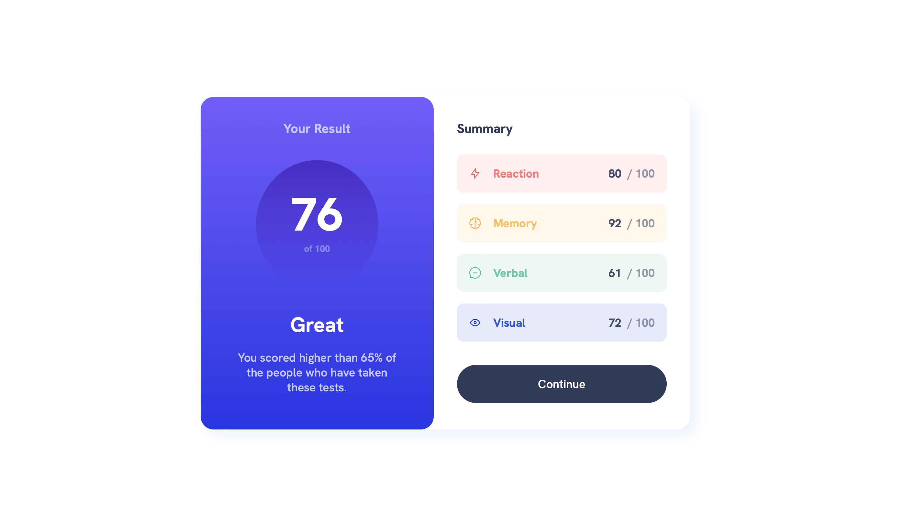
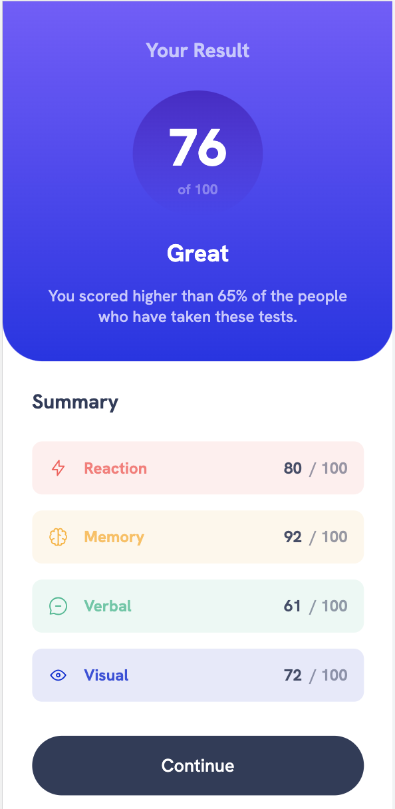

# Frontend Mentor - Results summary component solution

This is a solution to the [Results summary component challenge on Frontend Mentor](https://www.frontendmentor.io/challenges/results-summary-component-CE_K6s0maV). Frontend Mentor challenges help you improve your coding skills by building realistic projects. 

## Table of contents

- [Overview](#overview)
  - [The challenge](#the-challenge)
  - [Screenshot](#screenshot)
  - [Links](#links)
- [My process](#my-process)
  - [Built with](#built-with)
  - [What I learned](#what-i-learned)
  - [Continued development](#continued-development)
- [Author](#author)

## Overview

### The challenge

Users should be able to:

- View the optimal layout for the interface depending on their device's screen size
- See hover and focus states for all interactive elements on the page

### Screenshot

### Links

- Solution URL: [https://github.com/felipestefani/results-summary-component-main](https://github.com/felipestefani/results-summary-component-main)
- Live Site URL: [https://felipestefani.github.io/results-summary-component-main/](https://felipestefani.github.io/results-summary-component-main/)

## My process

First of all, I did the Desktop design. Although the mobile first methord is widely applied, my goal here is to develop sites prioritizing desktop devices.
Here I just used basic html and css because it's about a simple page, so I didn't use nothing more than the simple tools.

### Built with

- Semantic HTML5 markup
- CSS custom properties
- Flexbox
- Desktop-first workflow  

### What I learned

I`ve developed this project to affirm myself my knowledge about the main html and css tools.
I am always pushing myself to remember and fix the basics, so I always try to do this kind of project.

### Continued development

As said before, I'll always keep doing this kind os project to improve myself and my knowledge!

## Author

- LinkedIn - [Felipe Stefani](https://www.linkedin.com/in/felipe-stefani-a35185116/)
- Frontend Mentor - [@felipestefani](https://www.frontendmentor.io/profile/felipestefani)
- Instagram - [@felipestefani](https://www.instagram.com/felipestefani/)
